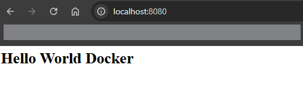

## curl-DockerFile

Construire le docker
```bash
docker build -t curl-image -f curl-dockerfile .
```

Démarrer est supprimer lorsque l'image a terminé son éxécution
```bash
docker run --rm curl-image
```

## staticHtml-DockerFile

Construire le docker 
```bash
docker build -t static-html -f staticHtml-DockerFile .
```

executer le docker
```bash
docker run -p 8080:80 static-html
```

résultat sur un navigateur


## Python-DockerFile


A la fin de l'éxécution de tout les docker mettre cette commande pour supprimer le cache :
```bash
docker system prune -af
```